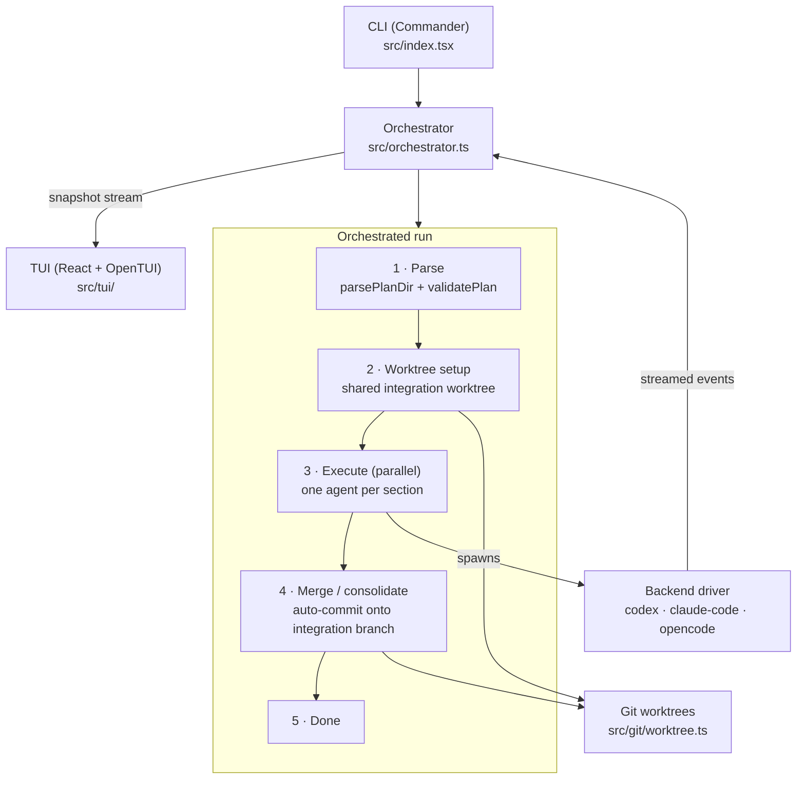

# Architecture

Parallely turns a set of markdown "sections" into concurrently-running AI coding agents,
supervises them from a terminal UI, and consolidates their work onto a single integration
branch. This document traces how a run flows through the system.

## High-level flow

## Components

| Area              | Files                     | Responsibility                                                            |
| ----------------- | ------------------------- | ------------------------------------------------------------------------- |
| **CLI**           | `src/index.tsx`           | Parses commands/flags (Commander), wires config, launches the TUI or run. |
| **Orchestrator**  | `src/orchestrator.ts`     | The engine: drives phases, spawns agents, tracks a `RunSnapshot`.          |
| **Plan**          | `src/plan/`               | `parser.ts` reads frontmatter + body; `validator.ts` flags overlaps/gaps. |
| **Backends**      | `src/backends/`           | `driver.ts` selects a backend; each driver adapts one agent CLI/SDK.      |
| **Git**           | `src/git/worktree.ts`     | Creates the shared worktree, commits section work, merges, cleans up.     |
| **TUI**           | `src/tui/`                | React-in-terminal via OpenTUI: overview, detail, and split views.         |
| **Types / utils** | `src/types.ts`, `utils.ts`| Shared domain types and helpers (token math, spawn, slug, timing).        |

## The run lifecycle

The orchestrator advances through explicit phases (`Phase` in `src/types.ts`):

1. **Parsing** — resolve the repo root and base branch, verify the backend CLI is
   installed, parse `.parallely/plan/*.md`, and validate. Validation surfaces file
   overlaps between sections so conflicting work is visible up front.
2. **Worktree setup** — create a shared integration worktree from the base branch and
   record the integration branch on the snapshot.
3. **Executing** — launch one agent per section concurrently. Each backend driver streams
   machine-readable events (token usage, messages, session id) back to the orchestrator,
   which folds them into the live snapshot. Failed sections retry with backoff.
4. **Merging / consolidation** — section work is auto-committed and merged onto the
   integration branch; conflicts are reported rather than silently dropped.
5. **Done** — results are persisted; per-section worktrees are cleaned up unless
   `--no-cleanup` was passed.

## State & rendering

The orchestrator owns a single `RunSnapshot` and exposes a subscribe API. The TUI is a
pure function of that snapshot: on each throttled emit, React/OpenTUI re-renders the
overview, detail, or split view. Keyboard handling lives in `src/tui/tui-root.tsx`, and
view state is managed with a reducer in `src/tui/tui-state.ts`.

## Backends

Every backend implements the `BackendDriver` interface (`src/types.ts`):

- `checkVersion()` — fail fast if the CLI isn't installed.
- `buildArgs()` — construct the spawn command for a prompt.
- `parseStdoutLine()` — translate the agent's JSON stream into `ParsedBackendEvent`s.
- `execute?()` — an optional SDK path (used by the Codex driver) that bypasses
  spawn+parse for richer streaming.

Adding a backend means implementing that interface and registering it in
`src/backends/driver.ts`.
